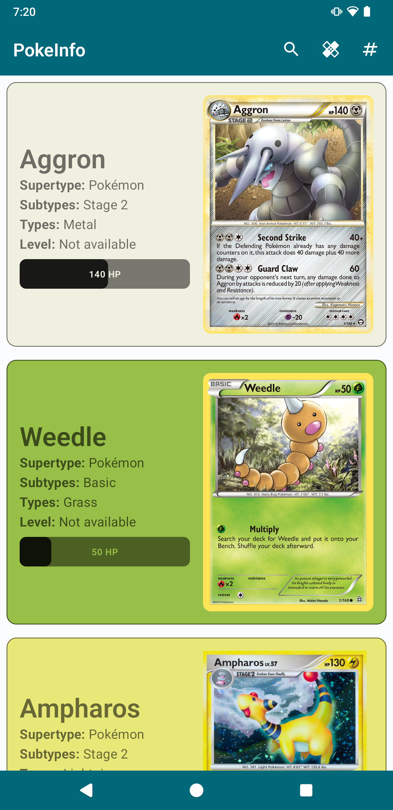
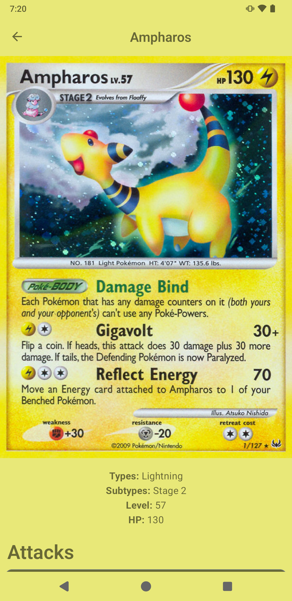
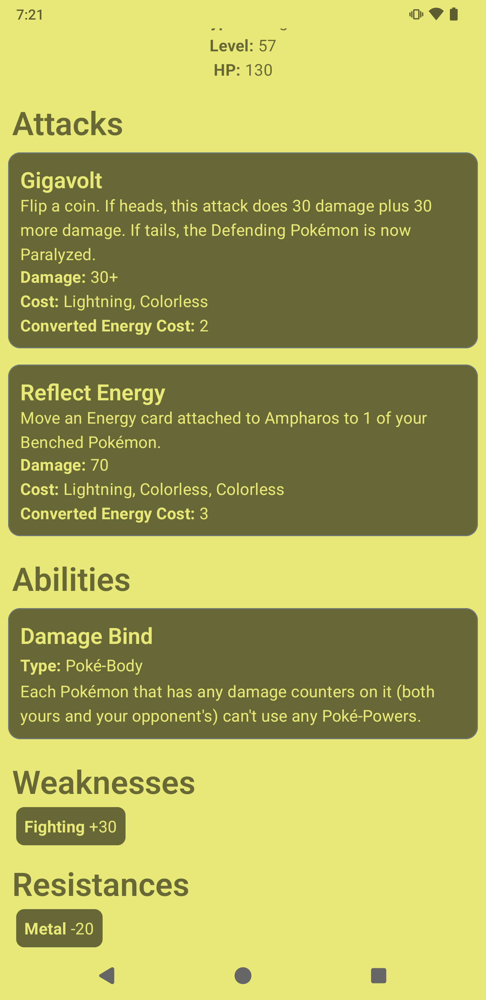

## PokeInfo
An app for browsing Pokemon's, made using PokemonTcg API.

This app uses -

1. Jetpack Compose for UI development
2. MVVM + Clean Architecture
3. Koin for Dependency Injection
4. Ktor for networking

The major deciding factor for using Koin and Ktor is future-proofing the app to make it compatible with KMM, so maximum effort has been put into making it 100% Kotlin.

Here's the screenshots of the app -

And here's  a video -
](https://www.youtube.com/watch?v=KAjfoSLuKvo)

Enjoy!
